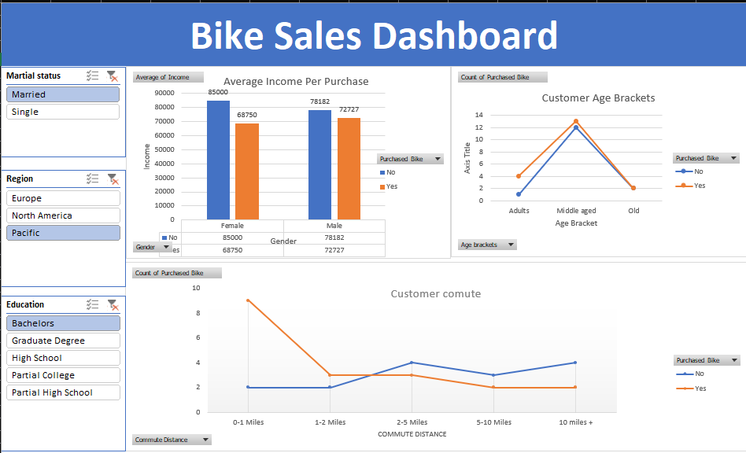

# 🚴 Bike Sales Dashboard (Excel)

An interactive Excel dashboard that visualizes bike purchase data across customer demographics, regions, and commute patterns. Built to support marketing and sales strategy through data-driven insights.

## 📊 Features
- Average income per purchase segmented by gender and marital status
- Customer age brackets and purchase trends
- Commute distance vs. purchase behavior
- Interactive filters for marital status, region, and education level

## 🖼️ Snapshot

## 🛠️ How to Use
1. Open `BikeSalesDashboard.xlsx` in Excel
2. Use slicers to filter data by region, marital status, and education
3. Explore visualizations to uncover trends and insights

## 🎬 Demo Video
[Click here to download and watch the dashboard demo](dashboardshot.mp4)

## 🧰 Tools & Techniques
- Microsoft Excel
- Pivot Tables
- Slicers & Filters
- Bar and Line Charts
- Conditional Formatting

## 🔍 Insights
- Married males show the highest average income per purchase
- Adults and middle-aged customers are the most active buyers
- Longer commutes correlate with fewer purchases
